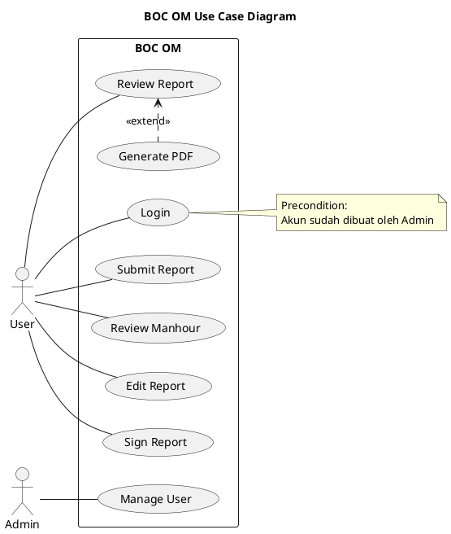

# Requirements - BOC OM

| User class | Use cases                                                                                   |
| ---------- | ------------------------------------------------------------------------------------------- |
| User       | Login, Submit Report, Review Manhour, Edit Report, Sign Report, Review Report, Generate PDF |
| Admin      | Manage User                                                                                 |

## User Stories

- Sebagai user, saya bisa login dengan akun yang dibuat oleh admin
## Acceptance Criteria

- Login valid → masuk home page
- Login invalid → error message
