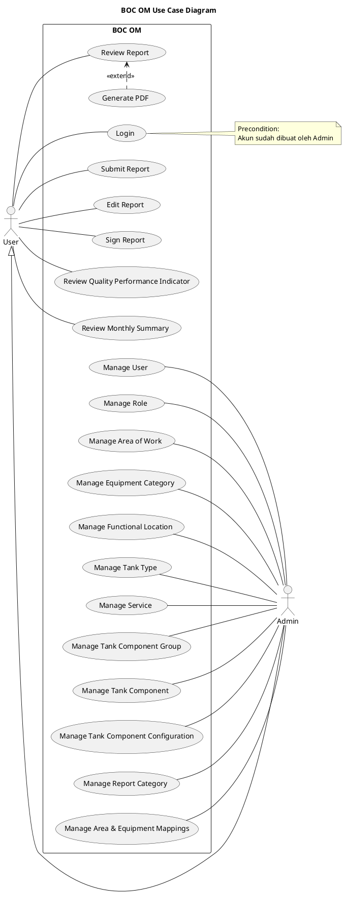
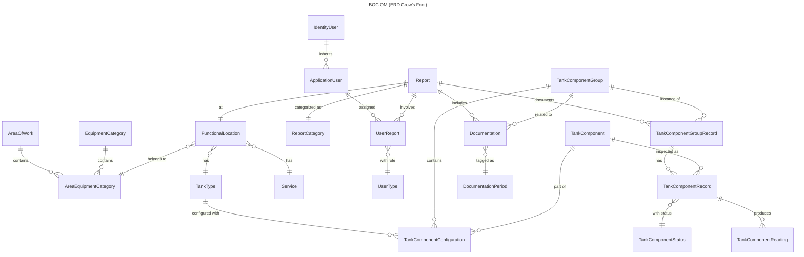
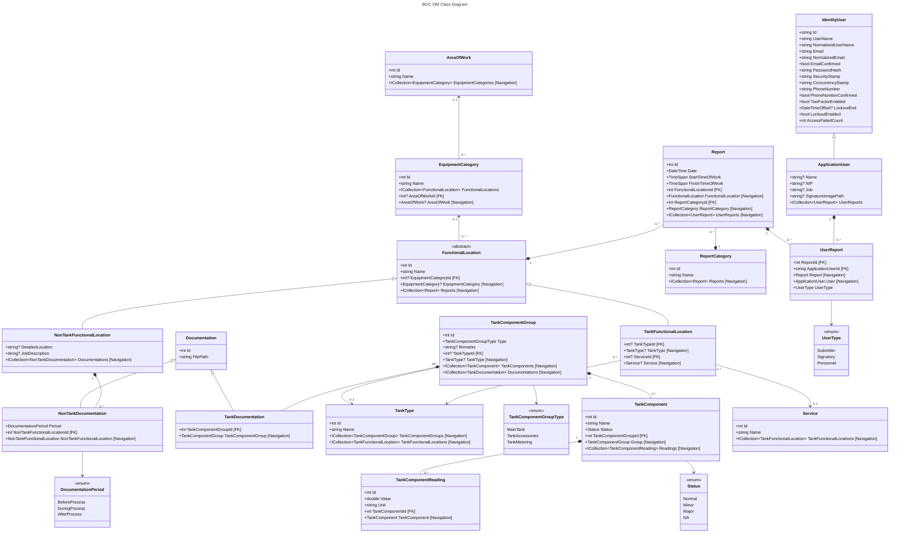
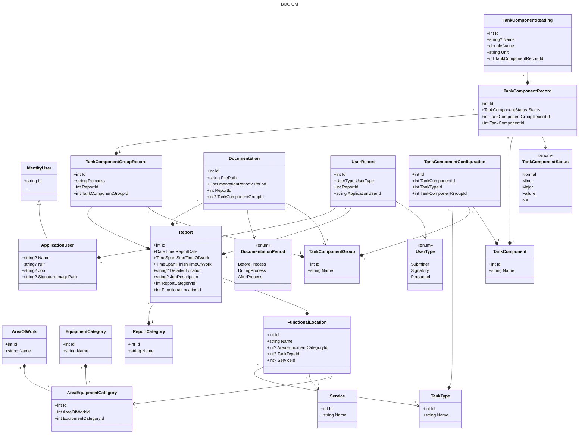
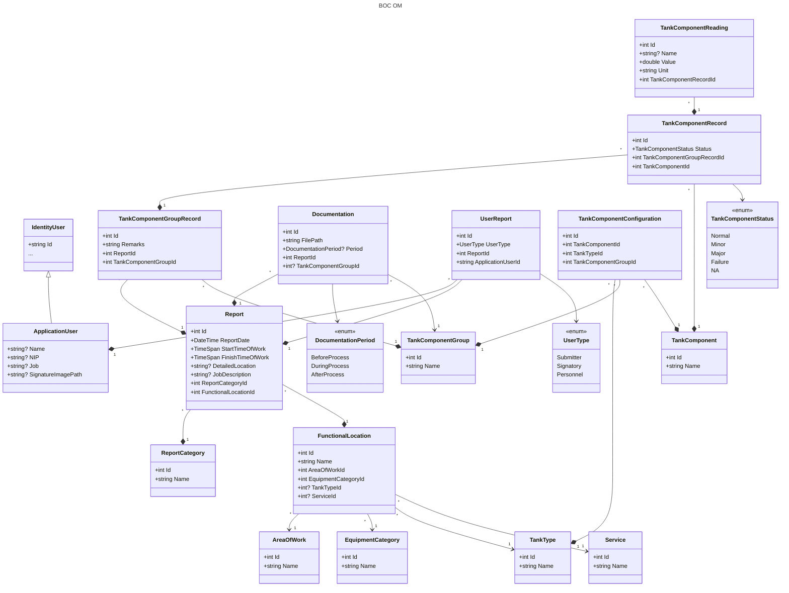

# Requirements - BOC OM

| User class | Use cases                                                                                                                                                                                                                                                                                 |
| ---------- | ----------------------------------------------------------------------------------------------------------------------------------------------------------------------------------------------------------------------------------------------------------------------------------------- |
| User       | Login, Submit Report, Edit Report, Sign Report, Review Report, Generate PDF, Review Quality Performance Indicator, Review Monthly Summary                                                                                                                                                 |
| Admin      | Manage User, Manage Role, Manage Area of Work, Manage Equipment Category, Manage Functional Location, Manage Tank Type, Manage Service, Manage Tank Component Group, Manage Tank Component, Manage Tank Component Configuration, Manage Report Category, Manage Area & Equipment Mappings |

## User Stories

- Sebagai user, saya bisa login dengan akun yang dibuat oleh admin
## Acceptance Criteria

- Login valid → masuk home page
- Login invalid → error message

## ERD

## Class Diagram

New

42-T-101G -- Floating Roof
42-T-101A -- Floating Roof
42-T-402B -- Spherical

Floating Roof -- Main Tank
Floating Roof -- Tank Accessories
Floating Roof -- Tank Metering
Spherical -- Main Tank
Spherical -- Tank Accessories
Spherical -- Tank Metering

Visual Plate -- (Floating Roof -- Main Tank)
Manhole -- (Floating Roof -- Main Tank)
Visual Plate -- (Spherical -- Main Tank)
Manhole -- (Spherical -- Main Tank)

minor

Ketika generate form, perlu mengetahui: TankType untuk generate component group yang dalam tiap component group memiliki component masing-masing