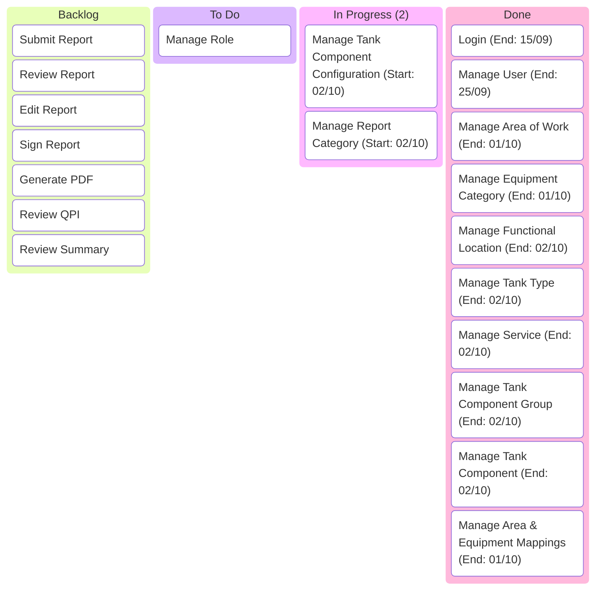

# Kanban - BOC OM

```mermaid
kanban
  backlog[Backlog]
	  b2[Submit Report]
	  b3[Review Report]
	  b4[Edit Report]
	  b5[Sign Report]
	  b6[Generate PDF]
	  b7[Review QPI]
	  b8[Review Summary]

  todo[To Do]
	  t10[Manage Role]
	  
  inprogress["In Progress (2)"]
	  t18["Manage Tank Component Configuration (Start: 02/10)"]
	  t19["Manage Report Category (Start: 02/10)"]
	  

  done[Done]
	  d1["Login (End: 15/09)"]
	  d9["Manage User (End: 25/09)"]
	  d11["Manage Area of Work (End: 01/10)"]
	  d12["Manage Equipment Category (End: 01/10)"]
	  d13["Manage Functional Location (End: 02/10)"]
	  d14["Manage Tank Type (End: 02/10)"]
	  d15["Manage Service (End: 02/10)"]
	  d16["Manage Tank Component Group (End: 02/10)"]
	  d17["Manage Tank Component (End: 02/10)"]
	  d20["Manage Area & Equipment Mappings (End: 01/10)"]
```
