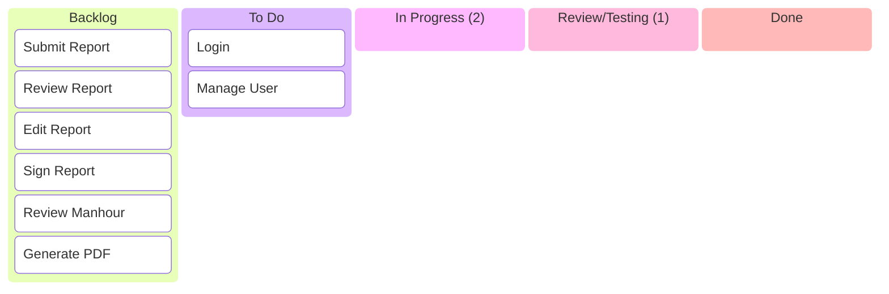

# Kanban - BOC OM

```mermaid
kanban
  backlog[Backlog]
    b2[Submit Report]
    b3[Review Report]
    b4[Edit Report]
    b5[Sign Report]
    b6[Review Manhour]
    b7[Generate PDF]

  todo[To Do]
    t1[Login]
    t8[Manage User]

  inprogress["In Progress (2)"]


  review["Review/Testing (1)"]
    

  done[Done]

```
