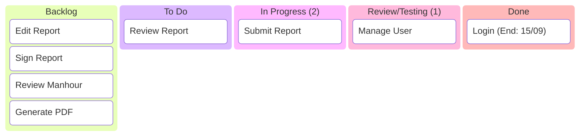

# Kanban - BOC OM

```mermaid
kanban
  backlog[Backlog]
    b4[Edit Report]
    b5[Sign Report]
    b6[Review Manhour]
    b7[Generate PDF]

  todo[To Do]
    t3[Review Report]

  inprogress["In Progress (2)"]
    i2[Submit Report]

  review["Review/Testing (1)"]
    r8["Manage User"]

  done[Done]
    d1["Login (End: 15/09)"]
```
