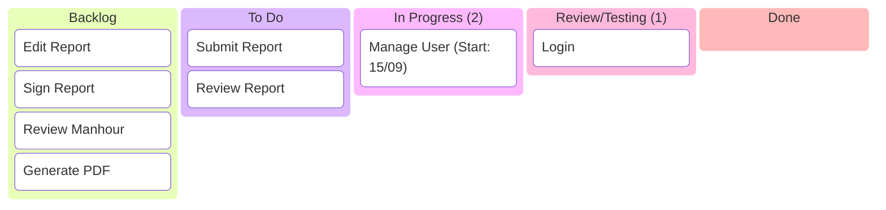

# Kanban - BOC OM

```mermaid
kanban
  backlog[Backlog]
    b4[Edit Report]
    b5[Sign Report]
    b6[Review Manhour]
    b7[Generate PDF]

  todo[To Do]
      t2[Submit Report]
      t3[Review Report]

  inprogress["In Progress (2)"]
    i8["Manage User (Start: 15/09)"]

  review["Review/Testing (1)"]
    r1[Login]

  done[Done]

```
