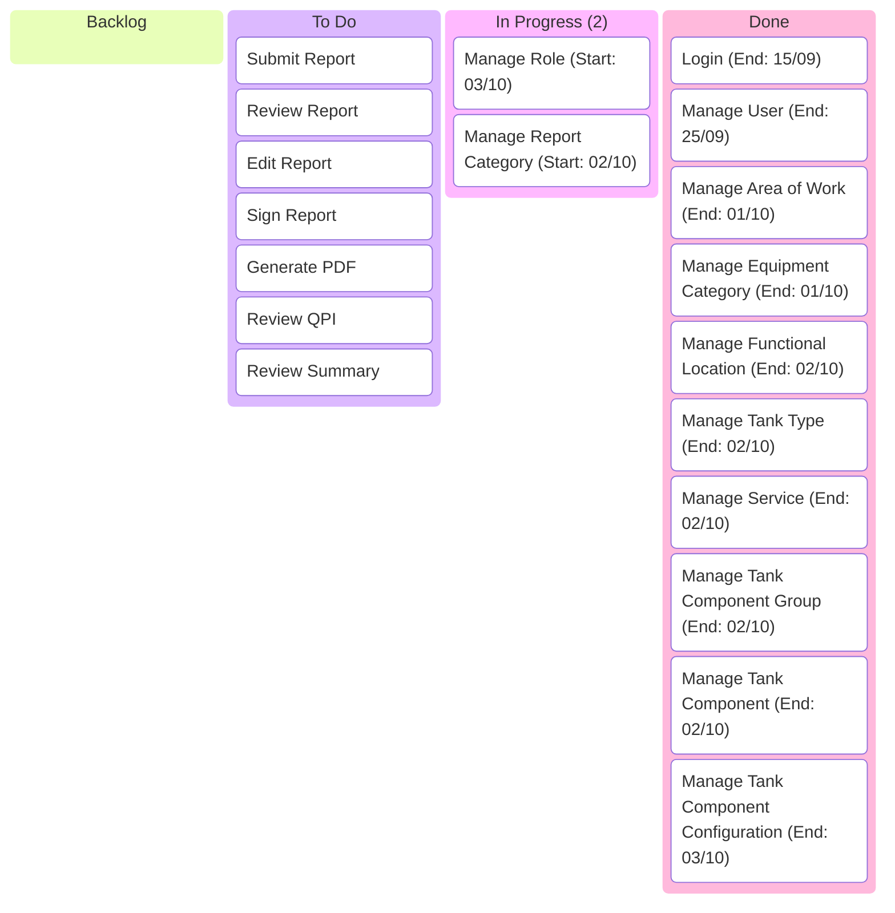

# Kanban - BOC OM

```mermaid
kanban
  backlog[Backlog]

  todo[To Do]
	  t2[Submit Report]
	  t3[Review Report]
	  t4[Edit Report]
	  t5[Sign Report]
	  t6[Generate PDF]
	  t7[Review QPI]
	  t8[Review Summary]
	  
  inprogress["In Progress (2)"]
	  i10["Manage Role (Start: 03/10)"]
	  i19["Manage Report Category (Start: 02/10)"]
	  

  done[Done]
	  d1["Login (End: 15/09)"]
	  d9["Manage User (End: 25/09)"]
	  d11["Manage Area of Work (End: 01/10)"]
	  d12["Manage Equipment Category (End: 01/10)"]
	  d13["Manage Functional Location (End: 02/10)"]
	  d14["Manage Tank Type (End: 02/10)"]
	  d15["Manage Service (End: 02/10)"]
	  d16["Manage Tank Component Group (End: 02/10)"]
	  d17["Manage Tank Component (End: 02/10)"]
	  d18["Manage Tank Component Configuration (End: 03/10)"]
```
