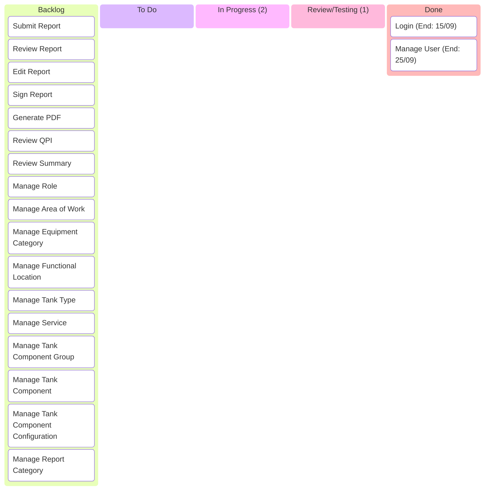

# Kanban - BOC OM

```mermaid
kanban
  backlog[Backlog]
	  b2[Submit Report]
	  b3[Review Report]
	  b4[Edit Report]
	  b5[Sign Report]
	  b6[Generate PDF]
	  b7[Review QPI]
	  b8[Review Summary]
	  b10[Manage Role]
	  b11[Manage Area of Work]
	  b12[Manage Equipment Category]
	  b13[Manage Functional Location]
	  b14[Manage Tank Type]
	  b15[Manage Service]
	  b16[Manage Tank Component Group]
	  b17[Manage Tank Component]
	  b18[Manage Tank Component Configuration]
	  b19[Manage Report Category]

  todo[To Do]
	  

  inprogress["In Progress (2)"]


  review["Review/Testing (1)"]

  done[Done]
	  d1["Login (End: 15/09)"]
	  d9["Manage User (End: 25/09)"]
```
