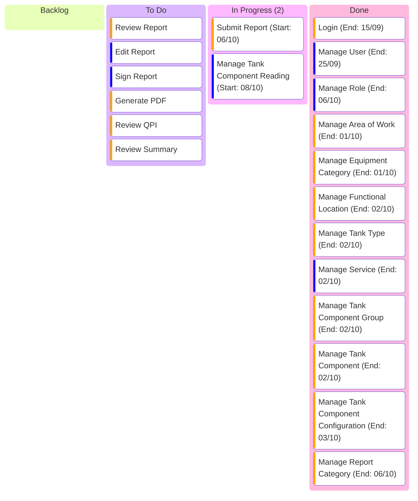

# Kanban - BOC OM

```mermaid
kanban
  backlog[Backlog]

  todo[To Do]
	  uc03[Review Report]@{priority: 'High'}
	  uc04[Edit Report]@{priority: 'Low'}
	  uc05[Sign Report]@{priority: 'Low'}
	  uc06[Generate PDF]@{priority: 'High'}
	  uc07[Review QPI]@{priority: 'High'}
	  uc08[Review Summary]@{priority: 'High'}
	  
	  
  inprogress["In Progress (2)"]
	  uc02["Submit Report (Start: 06/10)"]@{priority: 'High'}
	  uc20["Manage Tank Component Reading (Start: 08/10)"]@{priority: 'Low'}
	  

  done[Done]
	  uc01["Login (End: 15/09)"]@{priority: 'High'}
	  uc09["Manage User (End: 25/09)"]@{priority: 'Low'}
	  uc10["Manage Role (End: 06/10)"]@{priority: 'Low'}
	  uc11["Manage Area of Work (End: 01/10)"]@{priority: 'High'}
	  uc12["Manage Equipment Category (End: 01/10)"]@{priority: 'High'}
	  uc13["Manage Functional Location (End: 02/10)"]@{priority: 'High'}
	  uc14["Manage Tank Type (End: 02/10)"]@{priority: 'High'}
	  uc15["Manage Service (End: 02/10)"]@{priority: 'Low'}
	  uc16["Manage Tank Component Group (End: 02/10)"]@{priority: 'High'}
	  uc17["Manage Tank Component (End: 02/10)"]@{priority: 'High'}
	  uc18["Manage Tank Component Configuration (End: 03/10)"]@{priority: 'High'}
	  uc19["Manage Report Category (End: 06/10)"]@{priority: 'High'}
```
