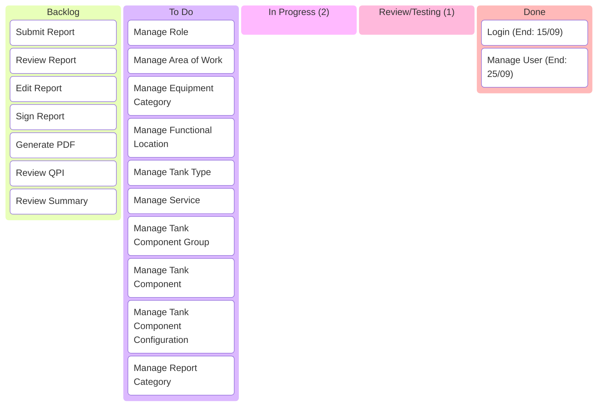

# Kanban - BOC OM

```mermaid
kanban
  backlog[Backlog]
	  b2[Submit Report]
	  b3[Review Report]
	  b4[Edit Report]
	  b5[Sign Report]
	  b6[Generate PDF]
	  b7[Review QPI]
	  b8[Review Summary]

  todo[To Do]
	  t10[Manage Role]
	  t11[Manage Area of Work]
	  t12[Manage Equipment Category]
	  t13[Manage Functional Location]
	  t14[Manage Tank Type]
	  t15[Manage Service]
	  t16[Manage Tank Component Group]
	  t17[Manage Tank Component]
	  t18[Manage Tank Component Configuration]
	  t19[Manage Report Category]

  inprogress["In Progress (2)"]


  review["Review/Testing (1)"]

  done[Done]
	  d1["Login (End: 15/09)"]
	  d9["Manage User (End: 25/09)"]
```
