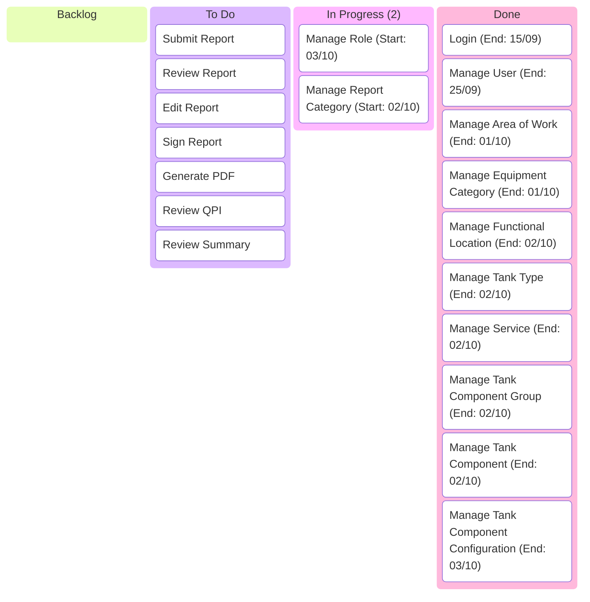

# BOC OM Kanban Report

## Board

## Metrik

### Lead Time

$$
\text{Lead Time} = \text{Completion Date} - \text{Entry Date}
$$

| Task                                | Creation Date | End Date   | Lead Time (Days) |
| ----------------------------------- | ------------- | ---------- | ---------------- |
| Login                               | 2025-09-10    | 2025-09-15 | 5                |
| Manage User                         | 2025-09-10    | 2025-09-25 | 15               |
| Manage Area of Work                 | 2025-10-01    | 2025-10-01 | 0                |
| Manage Equipment Category           | 2025-10-01    | 2025-10-01 | 0                |
| Manage Functional Location          | 2025-10-01    | 2025-10-02 | 1                |
| Manage Tank Type                    | 2025-10-01    | 2025-10-02 | 1                |
| Manage Service                      | 2025-10-01    | 2025-10-02 | 1                |
| Manage Tank Component Group         | 2025-10-01    | 2025-10-02 | 1                |
| Manage Tank Component               | 2025-10-01    | 2025-10-02 | 1                |
| Manage Tank Component Configuration | 2025-10-01    | 2025-10-03 | 2                |
**Average Lead Time**: $\frac{5 + 15 + 0 + 0 + 1 + 1 + 1 + 1 + 1 + 2}{10} = 2.7 \text{ hari} \approx 3 \text{ hari}$

### Cycle Time

$$
\text{Cycle Time} = \text{Done Date} − \text{In Progress Start Date}
$$

| Task                                | Start Date | End Date   | Cycle Time (Days) |
| ----------------------------------- | ---------- | ---------- | ----------------- |
| Login                               | 2025-09-14 | 2025-09-15 | 1                 |
| Manage User                         | 2025-09-15 | 2025-09-25 | 10                |
| Manage Area of Work                 | 2025-10-01 | 2025-10-01 | 0                 |
| Manage Equipment Category           | 2025-10-01 | 2025-10-01 | 0                 |
| Manage Functional Location          | 2025-10-01 | 2025-10-02 | 1                 |
| Manage Tank Type                    | 2025-10-01 | 2025-10-02 | 1                 |
| Manage Service                      | 2025-10-02 | 2025-10-02 | 0                 |
| Manage Tank Component Group         | 2025-10-02 | 2025-10-02 | 0                 |
| Manage Tank Component               | 2025-10-02 | 2025-10-02 | 0                 |
| Manage Tank Component Configuration | 2025-10-02 | 2025-10-03 | 1                 |

**Average Cycle Time**:  $\frac{1 + 10 + 0 + 0 + 1 + 1 + 0 + 0 + 0 + 1}{10} = 1.4 \text{ hari} \approx 1 \text{ hari}$

### Throughput

$$
\text{Throughput} = \frac{\text{Total Completed Items}}{\text{Time Interval}}
$$

- Total Task Done = 10 task
- 2025-09-15 s.d. 2025-09-30 = 16 hari
- 2025-10-01 s.d. 2025-10-03 = 3 hari
- Total Hari = 15 + 3 = 19 hari 

**Delivery Rate**: $\frac{10 \text{ task}}{19 \text{ hari}} = \frac{0.53 \text{ task}}{hari} \times \frac{7 \text{ hari}}{pekan} = \frac{3.71 \text{ task}}{pekan} \approx 3 \text{ task/pekan}$

## Visualisasi

### Lead Time Run

![[Lead Time Run.png]]

### Lead Time Distribution

![[Lead Time Distribution.png]]

### Cumulative Flow Diagram

![[CFD.png]]

## Rekomendasi

	Berdasarkan metrik kanban, proyek membutuhkan waktu 9 task : 3 task/pekan = 3 pekan untuk penyelesaian sesuai target.