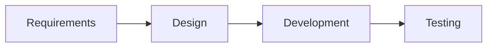
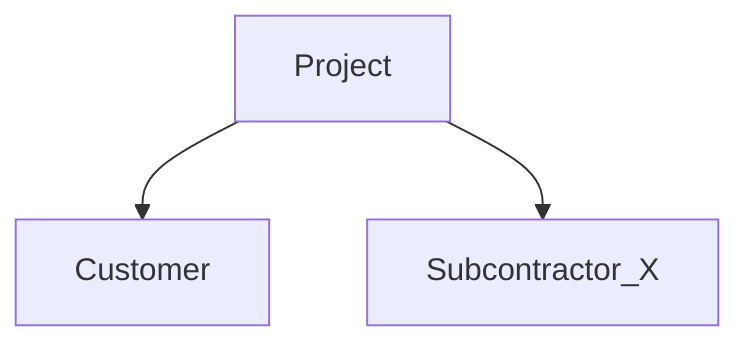
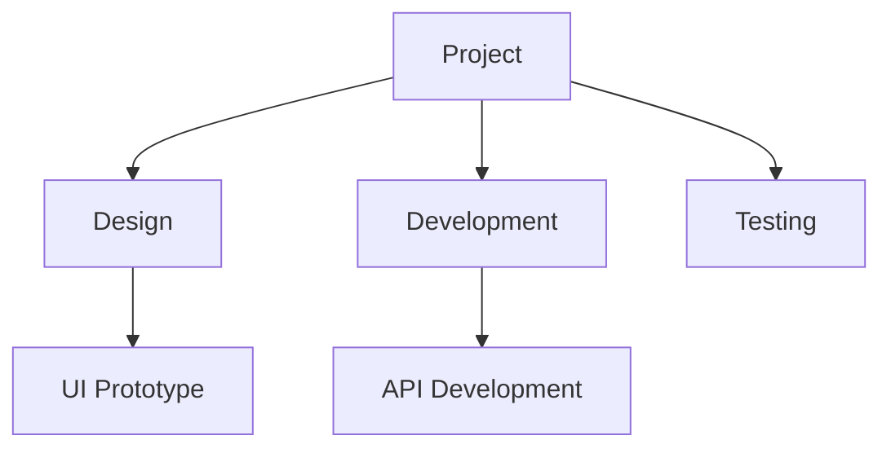

# PROJECT MANAGEMENT PLAN (PMP)

**Project Name:** Basic Operational Care (BOC OM)
**Date of Issue:** 2025-10-06
**Version:** 1.0  
**Prepared By:** Billdan Satriana Roseandree
**Approved By:** Irman Fauzan Rohim

---

## FRONT MATTER

### Title Page

- Project name, date, version, issuing organization.

### Approval Record

| Role           | Name/Title  | Signature | Date        |
| -------------- | ----------- | --------- | ----------- |
| Prepared By    |             |           |             |
| Reviewed By    |             |           |             |
| Approved By    |             |           |             |

  

### Change History

| Version | Date       | Sections Modified | Description of Change | Author  |
| ------- | ---------- | ----------------- | --------------------- | ------- |
| 1.0     | YYYY-MM-DD | All               | Initial draft         |         |
  
### Table of Contents  

*(Auto-generated in final document)*

### List of Figures/Tables  

*(Auto-generated in final document)*

---

## PROJECT OVERVIEW

### Project Summary

#### Purpose, Scope, Objectives

- **Purpose:** [Brief statement of business/system needs]  
- **Scope:** [Boundaries of the project]  
- **Objectives:**  
  1. [Objective 1]  
  2. [Objective 2]  
- **Success Criteria:** [Measurable indicators]  
- **Reference to Requirements:** [e.g., SRS Document ID]

#### 7.3.1.2 Assumptions and Constraints

- **Assumptions:**  
  - [Assumption 1, e.g., "Stable stakeholder requirements"]  
- **Constraints:**  
  - [Constraint 1, e.g., "Must use Azure cloud"]  
  - *Exclusions:* [Out-of-scope items]

#### 7.3.1.3 Project Deliverables

| Deliverable                    | Delivery Date  | Location/Format  | Special Instructions  |
| ------------------------------ | -------------- | ---------------- | --------------------- |
| Software Application           | YYYY-MM-DD     | Azure DevOps     | Encrypted transfer    |
| User Documentation             | YYYY-MM-DD     | PDF/Online       |                       |
| *[Reference CDRL/PPL if used]* |                |                  |                       |

#### 7.3.1.4 Schedule and Budget Summary

- **Key Milestones:**  
  - Design Complete: YYYY-MM-DD  
  - Testing Complete: YYYY-MM-DD  
- **Budget:** $[Total] (Detailed in §7.7.3.5)  
- **Payment Schedule:** [Phased payment details]

#### 7.3.1.5 Evolution of the Plan

- Update frequency: [e.g., Monthly/Per milestone]  
- Change control: [GitHub Issues/Jira]  
- Configuration management: [Azure Repos]
  
---

## 7.4 REFERENCES

| Document                   | Version  | Source/Link                      |
| -------------------------- | -------- | -------------------------------- |
| Software Requirements Spec | v1.2     | [Link]                           |
| ISO/IEC/IEEE 12207:2017    |          | [ISO Standards Portal]           |
| *[Add others]*             |          |                                  |

---

## 7.5 DEFINITIONS

| Term           | Definition                                   |
| -------------- | -------------------------------------------- |
| CDRL           | Contract Data Requirements List              |
| SDP            | Software Development Plan                    |
| *[Add others]* |                                              |

---

## PROJECT CONTEXT

### Process Model

- **Lifecycle Model:** [Agile/Waterfall/V-Model]  
- **Process Flow:**  

- **Tailoring**: [Deviations from organizational standards]

### Process Improvement

- Assessment frequency: [Quarterly]
- Improvement tracking: [Azure Boards]

### Infrastructure & Enabling Systems

- Tools:
  - IDE: Visual Studio 2022
  - CI/CD: Azure Pipelines
- Facilities: [Cloud/On-prem servers]
- Security: [ISO 27001 compliance]

### Methods, Tools, Techniques

- Design: UML via PlantUML
- Testing: xUnit/NUnit
- Project Mgmt: Azure DevOps

### Product Acceptance

- Criteria:
  - All test cases passed
  - Zero critical bugs
- Methods: User Acceptance Testing (UAT)

### Project Organization

#### External Interfaces

#### 7.6.6.3 Internal Interfaces

Teams: Frontend, Backend, QA
Reporting: [Weekly syncs via Teams]

#### 7.6.6.4 Authorities & Responsibilities

Role  Responsibility  Authority Level
Project Manager Overall delivery, budget control  High
Lead Developer  Technical decisions Medium

## 7.7 PROJECT PLANNING

### 7.7.2 Project Initiation

#### 7.7.2.2 Estimation

Methods: Function Point Analysis, historical data
Confidence Level: 80% (±10% budget)

#### 7.7.2.3 Staffing

Role  Qty Phase Duration (months)
Developer 5 Development 6
QA Engineer 2 Testing 3
  
#### 7.7.2.4 Resource Acquisition

Hardware: 10 Azure VMs (procured by [Date])
Software Licenses: JetBrains Suite

#### 7.7.2.5 Project Staff Training

Topics: ASP.NET Core security workshops
Method: Instructor-led + Microsoft Learn

### 7.7.3 Project Work Plans

#### 7.7.3.2 Work Activities (WBS)

  

#### 7.7.3.3 Schedule Allocation

Gantt Chart: (Embed or link)
Critical Path: [Key dependencies]

#### 7.7.3.4 Resource Allocation

Task  Developer Hrs QA Hrs  Tools
API Development 200 - Visual Studio

#### 7.7.3.5 Budget Allocation

Category  Amount ($)
Labor 150,000
Cloud Services  20,000

#### 7.7.3.6 Procurement

Subcontracted: [Security testing to Vendor ABC]
Contract Type: Fixed-price

#### 7.7.3.7 Disposal

Data sanitization: [ShredBit tool]
License decommissioning

## 7.8 PROJECT ASSESSMENT & CONTROL

### 7.8.2 Requirements Management

Tool: Azure DevOps Requirements Traceability Matrix (RTM)

### 7.8.3 Scope Change Control

Process: [Change Request Form → CAB Approval]

### 7.8.4 Schedule Control

Method: Earned Value Management (EVM)
Threshold: >10% deviation triggers review
  
### 7.8.5 Budget Control

Tracking: Monthly variance reports

### 7.8.6 Quality Assurance

Standards: ISO 9001, ASP.NET Core coding guidelines

### 7.8.7 Subcontractor Management

Criteria: ISO 27001 certification required
Reporting: Biweekly status updates

### 7.8.8 Project Closeout

Activities:
Post-mortem analysis
Knowledge transfer to ops

## 7.9 PRODUCT DELIVERY

Method: Phased rollout to 5% users
Documentation: Online wiki + PDF manuals
Support Handover: [Team contact details]

## 7.10 SUPPORTING PROCESSES

### 7.10.3 Decision Management

Escalation Path: Team Lead → PM → Steering Committee

### 7.10.4 Risk Management

Register: (Link to risk log)
Response Strategies: Mitigate/Accept/Transfer

### 7.10.5 Configuration Management

Tools: Git (branching strategy: GitFlow)
Baselines: [v1.0 Requirements Baseline]

### 7.10.6 Information Management

#### 7.10.6.2 Project Information Management

Deliverables Storage: SharePoint
Non-Deliverables: [Design drafts in Confluence]

#### 7.10.6.3 Communication Plan

Audience  Channel Frequency
Stakeholders  Email/Teams Weekly
Team  Daily standup Daily

### 7.10.7 Quality Assurance

Audits: Quarterly ISO 9001 internal audits

### 7.10.8 Measurement

Metrics: Velocity, Defect Density
Tool: Azure DevOps Dashboards

### 7.10.9 Reviews & Audits

Types: Code reviews (Pull Requests), UAT  

### 7.10.10 Verification & Validation

V&V Plan ID: [Reference separate document]

## 7.11 ADDITIONAL PLANS

Security Plan: [Link to ISO 27001 compliance doc]
Disaster Recovery Plan: [Azure Site Recovery config]  

## 7.12 END MATTER

Annexes

A.1: Risk Register Template

A.2: Change Request Form

  

Glossary

Term  Definition

SLA Service Level Agreement

KPI Key Performance Indicator

  

### Key Implementation Notes:

1. **Placeholders**: Replace `[ ]` with project-specific details.

2. **Mermaid Diagrams**: Requires Mermaid support (e.g., GitHub/GitLab). Use alternatives if needed.

3. **Compliance**:

   - Align with ISO/IEC/IEEE 12207 (software) and 15288 (systems).
   - Reference SEMP (ISO/IEC/IEEE 24748-4) and SDP (ISO/IEC/IEEE 24748-5) where applicable.

4. **Tailoring**: Adjust sections per project complexity (e.g., omit §7.11 for small projects).

5. **Automation**:

   - Use Azure DevOps/Jira for real-time tracking (§7.8.4, §7.8.5).
   - Generate TOC/figures dynamically via Markdown processors.

  

> **Disclaimer**: This template aligns with ISO/IEC/IEEE 16326:2019 but must be customized for organizational/regulatory needs. Always verify compliance with latest standards.

> Generated by DeepSeek