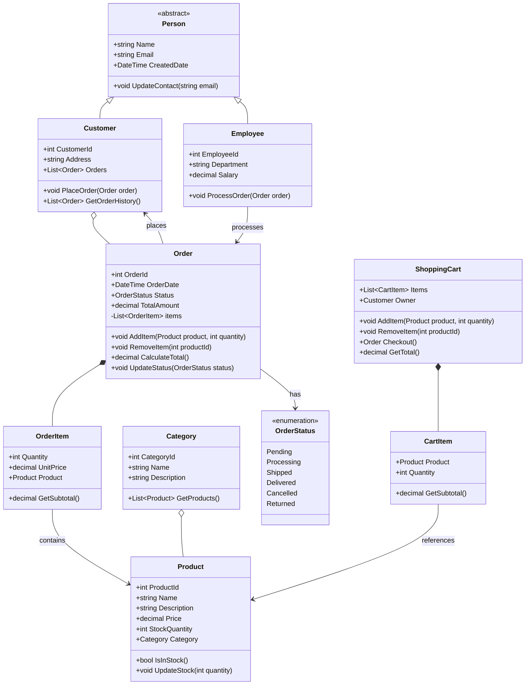

	## Class Diagram



## C# Code

```csharp
using System;
using System.Collections.Generic;
using System.Linq;

// Enumeration for Order Status
public enum OrderStatus
{
    Pending,
    Processing,
    Shipped,
    Delivered,
    Cancelled,
    Returned
}

// Abstract base class demonstrating inheritance
public abstract class Person
{
    public string Name { get; set; }
    public string Email { get; set; }
    public DateTime CreatedDate { get; set; }

    protected Person()
    {
        CreatedDate = DateTime.Now;
    }

    public virtual void UpdateContact(string email)
    {
        Email = email;
    }
}

// Customer inherits from Person
public class Customer : Person
{
    public int CustomerId { get; set; }
    public string Address { get; set; }
    public List<Order> Orders { get; set; }

    public Customer()
    {
        Orders = new List<Order>();
    }

    public void PlaceOrder(Order order)
    {
        order.Customer = this;
        Orders.Add(order);
    }

    public List<Order> GetOrderHistory()
    {
        return Orders.ToList();
    }
}

// Employee also inherits from Person
public class Employee : Person
{
    public int EmployeeId { get; set; }
    public string Department { get; set; }
    public decimal Salary { get; set; }

    public void ProcessOrder(Order order)
    {
        if (order.Status == OrderStatus.Pending)
        {
            order.UpdateStatus(OrderStatus.Processing);
            Console.WriteLine($"Order {order.OrderId} processed by {Name}");
        }
    }
}

// Category class - demonstrates aggregation with Product
public class Category
{
    public int CategoryId { get; set; }
    public string Name { get; set; }
    public string Description { get; set; }
    private List<Product> _products;

    public Category()
    {
        _products = new List<Product>();
    }

    public List<Product> GetProducts()
    {
        return _products.ToList();
    }

    public void AddProduct(Product product)
    {
        product.Category = this;
        _products.Add(product);
    }
}

// Product class
public class Product
{
    public int ProductId { get; set; }
    public string Name { get; set; }
    public string Description { get; set; }
    public decimal Price { get; set; }
    public int StockQuantity { get; set; }
    public Category Category { get; set; }

    public bool IsInStock()
    {
        return StockQuantity > 0;
    }

    public void UpdateStock(int quantity)
    {
        StockQuantity += quantity;
        if (StockQuantity < 0)
            StockQuantity = 0;
    }
}

// CartItem - part of ShoppingCart composition
public class CartItem
{
    public Product Product { get; set; }
    public int Quantity { get; set; }

    public decimal GetSubtotal()
    {
        return Product.Price * Quantity;
    }
}

// ShoppingCart - demonstrates composition with CartItem
public class ShoppingCart
{
    public List<CartItem> Items { get; private set; }
    public Customer Owner { get; set; }

    public ShoppingCart(Customer owner)
    {
        Items = new List<CartItem>();
        Owner = owner;
    }

    public void AddItem(Product product, int quantity)
    {
        var existingItem = Items.FirstOrDefault(i => i.Product.ProductId == product.ProductId);
        
        if (existingItem != null)
        {
            existingItem.Quantity += quantity;
        }
        else
        {
            Items.Add(new CartItem { Product = product, Quantity = quantity });
        }
    }

    public void RemoveItem(int productId)
    {
        Items.RemoveAll(i => i.Product.ProductId == productId);
    }

    public decimal GetTotal()
    {
        return Items.Sum(item => item.GetSubtotal());
    }

    public Order Checkout()
    {
        var order = new Order
        {
            Customer = Owner,
            OrderDate = DateTime.Now
        };

        foreach (var cartItem in Items)
        {
            order.AddItem(cartItem.Product, cartItem.Quantity);
        }

        Items.Clear(); // Clear cart after checkout
        return order;
    }
}

// OrderItem - part of Order composition
public class OrderItem
{
    public int Quantity { get; set; }
    public decimal UnitPrice { get; set; }
    public Product Product { get; set; }

    public decimal GetSubtotal()
    {
        return UnitPrice * Quantity;
    }
}

// Order class - demonstrates composition with OrderItem
public class Order
{
    public int OrderId { get; set; }
    public DateTime OrderDate { get; set; }
    public OrderStatus Status { get; set; }
    public decimal TotalAmount { get; private set; }
    public Customer Customer { get; set; }
    private List<OrderItem> _items;

    public Order()
    {
        _items = new List<OrderItem>();
        OrderDate = DateTime.Now;
        Status = OrderStatus.Pending;
    }

    public void AddItem(Product product, int quantity)
    {
        if (!product.IsInStock() || product.StockQuantity < quantity)
        {
            throw new InvalidOperationException("Insufficient stock");
        }

        var orderItem = new OrderItem
        {
            Product = product,
            Quantity = quantity,
            UnitPrice = product.Price
        };

        _items.Add(orderItem);
        product.UpdateStock(-quantity);
        CalculateTotal();
    }

    public void RemoveItem(int productId)
    {
        var item = _items.FirstOrDefault(i => i.Product.ProductId == productId);
        if (item != null)
        {
            _items.Remove(item);
            item.Product.UpdateStock(item.Quantity); // Return to stock
            CalculateTotal();
        }
    }

    public decimal CalculateTotal()
    {
        TotalAmount = _items.Sum(item => item.GetSubtotal());
        return TotalAmount;
    }

    public void UpdateStatus(OrderStatus status)
    {
        Status = status;
    }

    public List<OrderItem> GetItems()
    {
        return _items.ToList();
    }
}

// Example usage demonstrating the relationships
public class Program
{
    public static void Main()
    {
        // Create category (aggregation relationship with products)
        var electronics = new Category
        {
            CategoryId = 1,
            Name = "Electronics",
            Description = "Electronic devices and gadgets"
        };

        // Create products
        var laptop = new Product
        {
            ProductId = 1,
            Name = "Gaming Laptop",
            Description = "High-performance gaming laptop",
            Price = 1299.99m,
            StockQuantity = 10
        };

        var mouse = new Product
        {
            ProductId = 2,
            Name = "Gaming Mouse",
            Description = "Precision gaming mouse",
            Price = 79.99m,
            StockQuantity = 25
        };

        electronics.AddProduct(laptop);
        electronics.AddProduct(mouse);

        // Create customer (inheritance from Person)
        var customer = new Customer
        {
            CustomerId = 1,
            Name = "John Doe",
            Email = "john.doe@email.com",
            Address = "123 Main St"
        };

        // Create employee (inheritance from Person)
        var employee = new Employee
        {
            EmployeeId = 1,
            Name = "Jane Smith",
            Email = "jane.smith@company.com",
            Department = "Sales",
            Salary = 50000m
        };

        // Shopping cart (composition with CartItem)
        var cart = new ShoppingCart(customer);
        cart.AddItem(laptop, 1);
        cart.AddItem(mouse, 2);

        Console.WriteLine($"Cart Total: ${cart.GetTotal()}");

        // Checkout (creates Order with composition relationship to OrderItems)
        var order = cart.Checkout();
        customer.PlaceOrder(order);

        Console.WriteLine($"Order {order.OrderId} Total: ${order.TotalAmount}");
        Console.WriteLine($"Order Status: {order.Status}");

        // Employee processes order (association relationship)
        employee.ProcessOrder(order);
        Console.WriteLine($"Updated Order Status: {order.Status}");

        // Show stock levels after order
        Console.WriteLine($"Laptop Stock: {laptop.StockQuantity}");
        Console.WriteLine($"Mouse Stock: {mouse.StockQuantity}");
    }
}
```