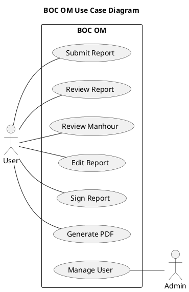
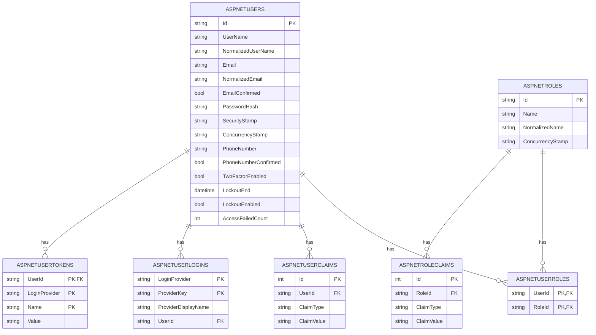

- Login
- Home
- Pilih Portal Area
- Pilih Report Category
- Pilih Report Date (default: Hari ini)
- Pilih Start Time (Default Jam dan Menit saat ini)
- Pilih Finish time

```plantuml
@startuml
title BOC OM Use Case Diagram

left to right direction

actor "User" as user
actor "Admin" as admin

rectangle "BOC OM" {
  (Submit Report) as report
  (Review Report) as review
  (Review Manhour) as manhour
  (Edit Report) as edit
  (Sign Report) as sign
  (Generate PDF) as generatepdf
  
  (Manage User) as manageuser
}

user -- report
user -- review
user -- manhour
user -- edit
user -- sign
user -- generatepdf

manageuser -- admin
@enduml
```

```mermaid
erDiagram
    ASPNETUSERS {
        string Id PK
        string UserName
        string NormalizedUserName
        string Email
        string NormalizedEmail
        bool EmailConfirmed
        string PasswordHash
        string SecurityStamp
        string ConcurrencyStamp
        string PhoneNumber
        bool PhoneNumberConfirmed
        bool TwoFactorEnabled
        datetime LockoutEnd
        bool LockoutEnabled
        int AccessFailedCount
    }

    ASPNETROLES {
        string Id PK
        string Name
        string NormalizedName
        string ConcurrencyStamp
    }

    ASPNETUSERROLES {
        string UserId PK, FK
        string RoleId PK, FK
    }

    ASPNETUSERCLAIMS {
        int Id PK
        string UserId FK
        string ClaimType
        string ClaimValue
    }

    ASPNETUSERLOGINS {
        string LoginProvider PK
        string ProviderKey PK
        string ProviderDisplayName
        string UserId FK
    }

    ASPNETUSERTOKENS {
        string UserId PK, FK
        string LoginProvider PK
        string Name PK
        string Value
    }

    ASPNETROLECLAIMS {
        int Id PK
        string RoleId FK
        string ClaimType
        string ClaimValue
    }

    %% Relationships
    ASPNETUSERS ||--o{ ASPNETUSERROLES : has
    ASPNETROLES ||--o{ ASPNETUSERROLES : has

    ASPNETUSERS ||--o{ ASPNETUSERCLAIMS : has
    ASPNETUSERS ||--o{ ASPNETUSERLOGINS : has
    ASPNETUSERS ||--o{ ASPNETUSERTOKENS : has

    ASPNETROLES ||--o{ ASPNETROLECLAIMS : has
```
