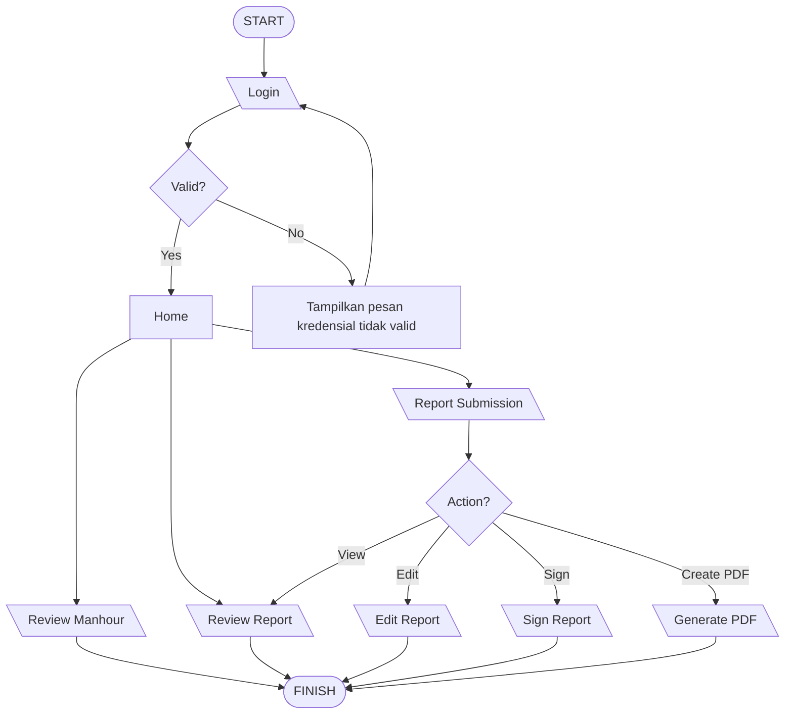

# Alur Report

- F&Q Area
	- Tank Daily Check
		- Pilih Tank Functional Location
		- Pilih 2 Checker Personel Wajib dan 1 Checker Personel Opsional
		- Pilih Start Time dan Finish time beserta Report Date
		- Submit
			- Tank Type dan Service berdasarkan Func. Loc.
			- Pilih status Main Tank Components
				- Isi Main Tank Components Remarks
				- Upload Findings (gambar)
			- Pilih status Tank Accessories
				- Isi Tank Accessories Remarks
				- Upload Findings (gambar)
			- Pilih status Tank Metering
				- Khusus Temperature Gauge Value (℃), Level Meter Value (mm), ATG Temperature Reading (℃), dan ATG Level Reading (mm) diisi satuan.
				- Isi Tank Metering Remarks
				- Upload Findings (gambar)
				- Submit
	- Valve Exercise
		- Pilih 3 Operator opsional untuk masing-masing Area 1-16 (Area = Location)
		- Pilih status masing-masing Valve tiap Area
		- Pilih Exercise Date untuk masing-masing Area
		- Submit
	- General GHK
		- Pilih Start Time
		- Pilih Finish Time
		- Pilih Report Date
		- Submit
			- Pilih Tank Functional Location
			- Pilih 12 Operator opsional
			- Isi Job Description
			- Upload Documentation Before, During, dan After Process
			- Submit
- EWTP Area
	- EWTP Support
		- Pilih Start Time
		- Pilih Finish Time
		- Pilih Report Date
		- Submit
			- Pilih Support Area
			- Pilih 12 Operator opsional
			- Isi Job Description
			- Upload Documentation Before, During, dan After Process
			- Submit
	- General GHK
		- Pilih Start Time
		- Pilih Finish Time
		- Pilih Report Date
		- Submit
			- Pilih Support Area
			- Pilih 12 Operator opsional
			- Isi Job Description
			- Upload Documentation Before, During, dan After Process
			- Submit
- Man Power Statistic
	- Pilih Periode
	- Create PDF
- Review Report
	- Pilih Report Date
	- Search
	- Review
	- Sign jika terotorisasi

1. Login: Username, Password ![[01-Alur.png]]
2. Home ![[02-Alur.png]]
	1. F&Q Area ![[02.1-Alur.png]]
		1. Tank Daily Check: 
			- TANK FUNCTIONAL LOCATION, Checker Personal, Start Time, Finish Time, Report Date ![[02.1.1.A-Alur.png]]
			- Status, Remarks, Foto => Main Tank Components, Tank Accessories, Tank Metering ![[02.1.1.B-Alur.png]]
		2. Valve Exercise: 
			- Report Periode ![[02.1.2.A-Alur.png]]
			- Operator, Status, Exercise Date, Remarks => Area 1 : 42-T-101A/42-T-102A, Area 2 : 42-T-101B/42-T-102B, Area 3 : 42-T-101CD, Area 4 : 42-T-101EFG/42-T-107D, Area 5 : 42-T-107ABC, Area 6 : 42-T-304AB, Area 7 : 42-T-305AB/42-T-503, Area 8 : 42-T-204/206, Area 9 : 42-T-105AB, Area 10 : 42-T-104AB, Area 11 : 42-T-301ABCD, Area 12 : 42-T-302AB/42-T-303AB, Area 13 : 42-T-201/42-T-202/42-T-205AB, Area 14 : 42-T-501AB/42-T-502AB, Area 15 : 42-T-203AB, Area 16 : 42-T-103AB/42-T-106 ![[02.1.2.B-Alur.png]]
		3. General GHK: 
			- Start Time, Finish Time, Report Date ![[02.2.1.A-Alur.png]]
			- TANK FUNCTIONAL LOCATION, Operator, Job Description, Documentation ![[02.1.3.B-Alur.png]]
	2. EWTP Area ![[02.2-Alur.png]]
		1. EWTP Support: 
			- Start Time, Finish Time, Report Date ![[02.2.1.A-Alur.png]]
			- Support Area, Operator, Job Description, Documentation ![[02.2.1.B-Alur.png]]
		2. General GHK: 
			- Start Time, Finish Time, Report Date ![[02.2.2.A-Alur.png]]
			- Support Area, Operator, Job Description, Documentation ![[02.2.2.B-Alur.png]]
	3. Man Power Statistic ![[03-Alur.png]]
	4. Review Report ![[04-Alur.png]]
