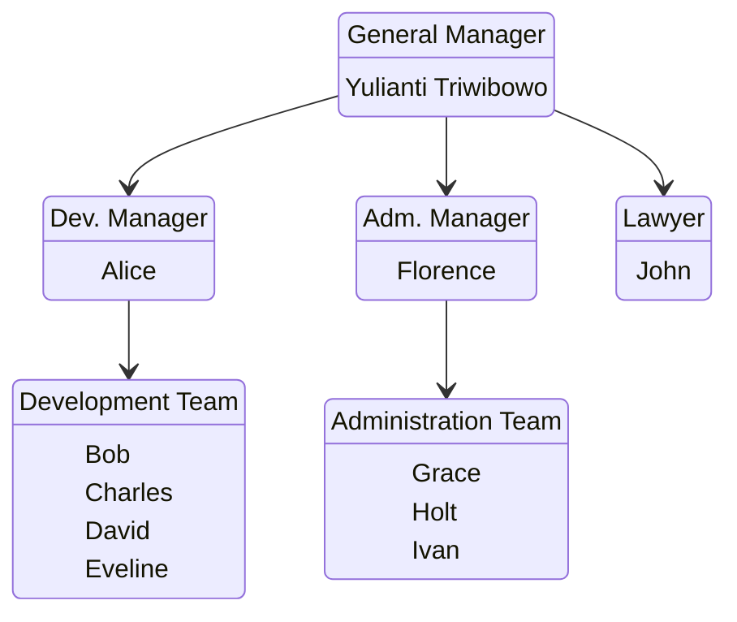

- 8 September
	- Safety Induction
	- Proses ID Card
	- Pengenalan awal pembimbing dan pembiasaan di lingkungan
- 9 September
	- Mendapat tugas membuat Visitor Management System
- 10 September
	- Cancel tugas lama
	- Mendapat tugas baru membuat BOC OM (Basic Operational Care)
	- Mendesain Use Case dan alur sistem BOC OM
	- Mempelajari Konsep dasar ASP.NET Core Web App (Model-View-Controller)
- 11 September
	- Lanjut belajar
		- CRUD perlu context.
		- Jika Action Controller fetch dari DB, gunakan async/await dan Task.
- 12 September
	- Belajar bahwa pengembangan itu mengikuti flow dari user, mulai dari tampilan baru ke data.
- 13 September
	- Belajar ASP.NET Core Web App (Model-View-Controller).
- 14 September
	- Belajar ASP.NET Core Identity.
- 15 September
	- SeedData
	- Mulai Frontend
	- Jadi tampilan Home Page
- 16 September
	- Lanjut frontend
	- Bikin breadcrumbs
- 17 September
	- Lanjut frontend
	- Bikin UI multi step form
	- Animasi card hover
	- Refactor code
	- Bantu catat stok tinta cartridge
	- Bantu angkat barang
- 18 September
	- Membuat halaman admin
	- Merapihkan navbar
	- Membuat sidebar untuk admin
- 19 September
	- Melanjutkan pengembangan fitur manage user admin
	- Bikin tabel daftar user
- 22 September
	- Mempertimbangkan implementasi table menggunakan MVC-only atau DataTables
	- Setup DataTables untuk users
- 23 September
	- Buat Migration untuk tambah kolom Name, NIP, Job, dan SignaturePath ke tabel AspNetUsers
	- Berhasil Create User menggunakan form modal
	- Implementasi Delete User
	- Mempertimbangkan Ajax atau pure MVC untuk CRUD
		- \_userForm mungkin gajadi
		- ManageUsersViewModel mungkin gajadi
- 24 September
	- Memindahkan barang megaphone dan speaker ke ruang lain
	- Berhasil implementasi create user form
	- Membuat Area Admin
	- Memilih arsitektur MVC murni dan tidak memakai AJAX
- 25 September
	- Belajar \_ViewImports dan \_ViewStart
	- Selesai implementasi Edit dan Delete User (Manage User)

