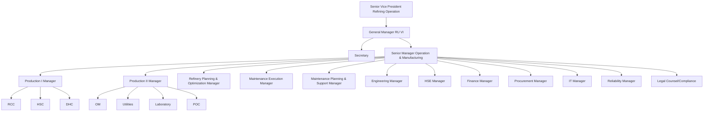

| No. | Tanggal          | Aktivitas                                                                                                                                                                                                                                                                                                                                                                                                                                                                                                                                                                                                                                                                                                                                                                                                                                                                                                                                                                                                                                                                                                                                                                                                                                                                                                                                                                                                                                                                                                                                                                                                                                                                                                                                                                                                                                                                                                                                                                                                                                                                                                                                                                                                                                                                                                                                                                                                                                                                                                                                                                                                                                                                                                                                                                                                                                                                         |
| --- | ---------------- | --------------------------------------------------------------------------------------------------------------------------------------------------------------------------------------------------------------------------------------------------------------------------------------------------------------------------------------------------------------------------------------------------------------------------------------------------------------------------------------------------------------------------------------------------------------------------------------------------------------------------------------------------------------------------------------------------------------------------------------------------------------------------------------------------------------------------------------------------------------------------------------------------------------------------------------------------------------------------------------------------------------------------------------------------------------------------------------------------------------------------------------------------------------------------------------------------------------------------------------------------------------------------------------------------------------------------------------------------------------------------------------------------------------------------------------------------------------------------------------------------------------------------------------------------------------------------------------------------------------------------------------------------------------------------------------------------------------------------------------------------------------------------------------------------------------------------------------------------------------------------------------------------------------------------------------------------------------------------------------------------------------------------------------------------------------------------------------------------------------------------------------------------------------------------------------------------------------------------------------------------------------------------------------------------------------------------------------------------------------------------------------------------------------------------------------------------------------------------------------------------------------------------------------------------------------------------------------------------------------------------------------------------------------------------------------------------------------------------------------------------------------------------------------------------------------------------------------------------------------------------------- |
| 1.  | 8 September 2025 | - Safety Induction - ID Card - Pengenalan awal pembimbin                                                                                                                                                                                                                                                                                                                                                                                                                                                                                                                                                                                                                                                                                                                                                                                                                                                                                                                                                                                                                                                                                                                                                                                                                                                                                                                                                                                                                                                                                                                                                                                                                                                                                                                                                                                                                                                                                                                                                                                                                                                                                                                                                                                                                                                                                                                                                                                                                                                                                                                                                                                                                                                                                                                                                                                                                    |
| 2.  | 9 September 2025 | - Tugas membuat Vis                                                                                                                                                                                                                                                                                                                                                                                                                                                                                                                                                                                                                                                                                                                                                                                                                                                                                                                                                                                                                                                                                                                                                                                                                                                                                                                                                                                        - Proof of concept - Tugas lama cancel - Tugas baru: Lapor kerusakan - Mendesain Use Case Diagram dan alur sistem BOC OM (Basic Operational Care Oil Movement) - Belajar bahwa Controller di ASP.NET Core Web App (Model-View-Controller) itu merender View berdasarkan direktori nama Controller dan subdirektori nama Action dalam Controller - Belajar bahwa Model yang diimport di View merender objek Model yang di-oper ke argumen fungsi View dalam Controller - Belajar bahwa tipe data return IActionResult dalam fungsi Action dalam Controller itu adalah Interface untuk mengabstraksikan render View (HTML, JSON, plain text, URL, redirect, status code). Return object yang class-nya implements IActionResult  - Belajar bahwa Action dalam Controller bisa menerima input (url segments, query strings, form submissions). Didefinisikan dari parameter fungsi Action - Belajar bahwa Razor adalah templating engine - Razor directives (@page, @using, @model) - Razor tag helpers (<form asp-action=..., <input asp-for=...) - EF Core adalah Object-Relational Mapping. Tidak hanya mengabstraksikan SQL ke C# (DBMS-agnostic), tetapi juga untuk migration - Dependencies -> Manage NuGet Packages (MS.EFCore \| .Tools \| .SqlServer) - Untuk menyimpan Model menjadi DB, diperlukan class Context - Flow code-first: Bikin Model, PMC->Add-Migration ""->Update-Database api  api  api  api  api  api |
- 10 September
	- Tugas lama cancel
	- Desain Use Case Diagram
- 12 September
	- Tampilan dulu dari BOC OM sebelum data

900 jam

Jam kerja harian = 07.00 s.d. 16.00 = 8 jam
Hari kerja per pekan = 7 hari - 2 hari libur = 5 hari kerja
Total hari non libur = 45 hari
Total = 45 x 8 = 360 jam

![[Pasted image 20251009104650.png]]

![[Pasted image 20251011223238.png]]

![[Pasted image 20251011223258.png]]

![[Pasted image 20251011223326.png]]

![[Pasted image 20251011223352.png]]

```mermaid
graph TD
    A[Senior Vice President Refining Operation] --> B(General Manager Refinery Unit VI)

    B --> C(Secretary)
    B --> D(Senior Manager Operation & Manufacturing)
    B --> E(Manager Engineering & Development)
    B --> F(Manager Reliability)
    B --> G(Manager Health, Safety & Environment)
    B --> H(Manager General Affairs)
    
    B --- I[Quality Management Section Head]
    B --- J[Internal Audit JBB Manager]
    B --- K[Unit Manager HC RU VI]
    B --- L[Manager Finance RU VI]
    B --- M[Area Manager IT RU VI]
    B --- N[Region Manager Marine III]
    B --- O[Director of Hospital Balongan]
    B --- P[Area Manager Legal Counsel RU VI]
    B --- Q[Unit Manager Communication & CSR RU VI]
    B --- R[Senior Supervisor Asset Management RU VI]
    
    D --> S(Manager Production I)
    D --> T(Manager Production II)
    D --> U(Manager Refinery Planning & Optimization)
    D --> V(Manager Turn Around)
    D --> W(Manager Maintenance Planning & Support)
    D --> X(Manager Maintenance Execution)
    
    E --> Y(Manager Procurement)
    E --> Z(Manager Operation Performance Improvement)
    
    B --> I
```

strukt org

```mermaid
graph TD
    SVPRO[Senior Vice President Refining Operation] --> GM[General Manager]

    GM --> S[Secretary]
    GM --> SMOM[Senior Manager Operation & Manufacturing]
    GM --> ED[Manager Engineering & Development]
    GM --> OPI[Manager Operation Performance Improvement]
    GM --> R[Manager Reliability]
    GM --> HSSE[Manager Health, Safety, Security & Environment]
    GM --> P[Manager Procurement]
    GM --> IA[Internal Audit Manager]
    GM --> HC[Manager HC]
    GM --> F[Manager Finance]
    GM --> IT[Manager IT]
    GM --> M[Manager Marine]
    GM --> LC[Manager Legal Counsel]
    GM --> CRCSR[Manager Communication, Relations & Corporate Social Responsibility]
    GM --> MAO[Manager Asset Operation]
    
    SMOM --> PI[Manager Production I]
    SMOM --> PII[Manager Production II]
    SMOM --> RPO[Manager Refinery Planning & Optimization]
    SMOM --> TA[Manager Turn Around]
    SMOM --> SS[Shift Superintendent]
    SMOM --> MPS[Manager Maintenance Planning & Support]
    SMOM --> ME[Manager Maintenance Execution]
    
    OPI --> QM[Quality Management Section Head]
    
    PI --> RCC
    PI --> HSC
    PI --> DHC

    PII --> OM
    PII --> U[Utilities]
    PII --> L[Laboratory]
    PII --> POC
```

